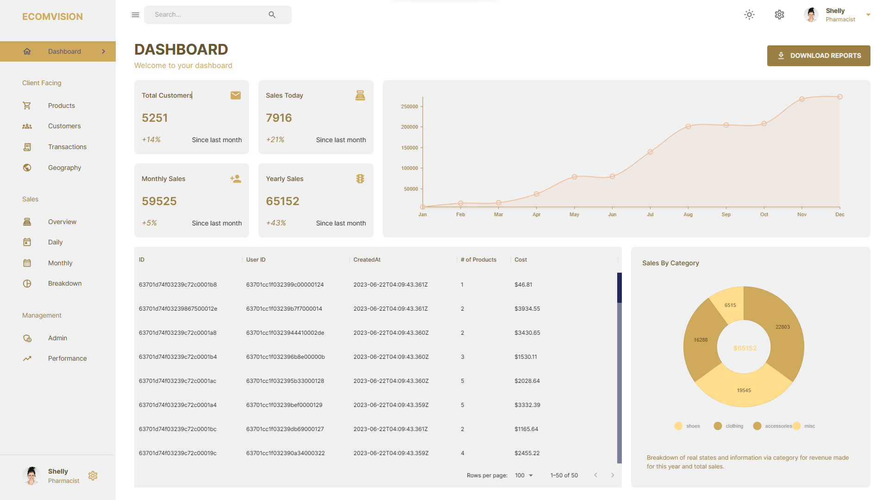

# eCommerce Dashboard `eComvision`

> Streamline e-commerce operations with powerful and intuitive dashboard management and growth.

## Banner Image



## Features

- Light/Dark Mode
- Display Geography
- Fetch from REST API
- Transition to Animation
- Functional Table (Sorting)
- Functional Graph & Charts (Different Views)
- Fully Responsive (PC, Laptop, Tablet & Mobile)

## Tech Stack

- Framework: `React.JS`
- State Container: `Redux Toolkit`
- Styling: `Emotion`
- Icons: `Hero JSX Icons`
- Database: `MongoDB`
- ORM: `Mongoose`
- Linting: `ESLint`
- Formatter: `Prettier`
- UI Component: `Materiul UI`
- Backend Server: `Express.Js Server`

## Clone Repo:

```bash
git clone https://github.com/developer-hasibulislam/ecomvision-clone.git
cd ecomvision-clone
npm i
npm fund
npm audit
npm i -f
npm audit fix
npm audit fix -f
```

## Environment Setup

### Client

```
REACT_APP_BASE_URL=
```

### Server

```
PORT=
MONGO_URL=
```

## Important Links

- Client Side - [Click Here](https://ecomvision-csr.vercel.app/)
- Server Side - [Click Here](https://ecomvision-ssr.vercel.app/)

# Author

> Expert Full Stack Developer || Lead Generation Expert

- Hasibul Islam
  - `Linkedin` [hasibulislam999](https://www.linkedin.com/in/developer-hasibulislam)
  - `WhatsApp` [+8801906315901](https://wa.me/01906315901)
